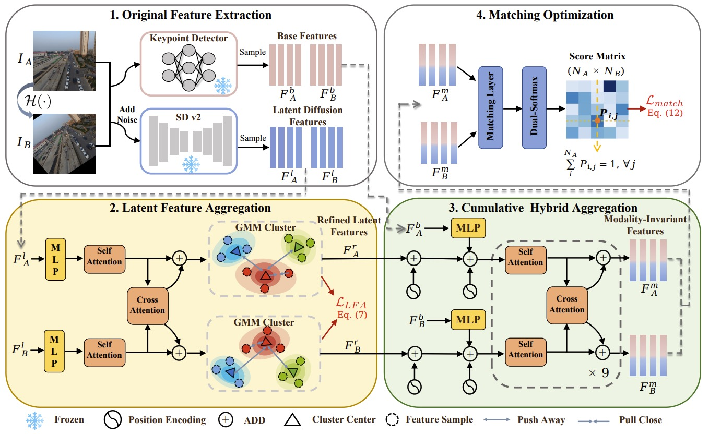
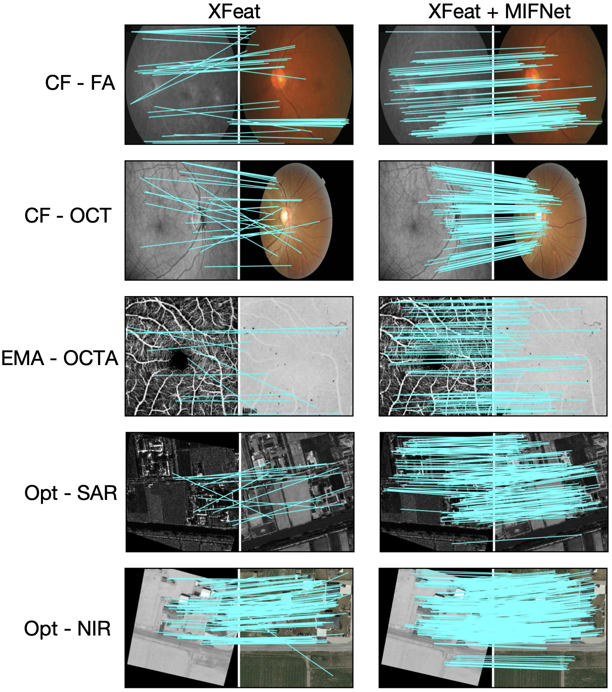

# MIFNet: Learning Modality-Invariant Features for Generalizable Multimodal Image Matching

This repository provides the official implementation of our paper:

**MIFNet: Learning Modality-Invariant Features for Generalizable Multimodal Image Matching**  
Accepted to **IEEE Transactions on Image Processing (TIP), 2025**  
[[ArXiv Paper](https://arxiv.org/pdf/2501.11299)]

---

## 📌 Introduction

Multimodal image matching is challenged by large appearance and texture discrepancies across modalities. **MIFNet** addresses this issue by learning modality-invariant features that generalize well across unseen domains. It combines low-level geometric features with high-level semantic guidance derived from a pretrained Stable Diffusion model. A lightweight GNN is further used to perform semantic-aware feature aggregation.

Key contributions:
- Introduces semantic features from Stable Diffusion for multimodal matching.
- Proposes a cross-modal hybrid aggregation network with a GNN backbone.
- Demonstrates strong generalization on various unseen multimodal datasets.

<!-- 插入框架图，宽度设为500像素 -->



---


## 🔧 Installation

```bash
conda create -n mifnet python=3.10
conda activate mifnet
pip install -r requirements.txt
```

---

## 🧪 Inference

You can run testing using the provided script. The output matching visualization will be saved in `output_images/`.

```bash
cd scripts
python test_xfeat_mifnet.py --mode cf-fa       # cf-fa, cf-oct, ema-octa, opt-sar, opt-nir
```

Example output:
<!-- 插入框架图，宽度设为500像素 -->



---

## 🏋️‍♂️ Training

Training code will be released soon. The training pipeline includes:
- Keypoint and descriptor supervision
- Semantic window relation distillation (Stable Diffusion)
- Cross-triplet descriptor loss

---

## 📖 Citation

If you find this work useful, please consider citing our paper:

```bibtex
@article{liu2025mifnet,
  title     = {MIFNet: Learning Modality-Invariant Features for Generalizable Multimodal Image Matching},
  author    = {Liu, Yepeng and Sun, Zhichao and Yu, Baosheng and Zhao, Yitian and Du, Bo and Xu, Yongchao and Cheng, Jun},
  journal   = {IEEE Transactions on Image Processing},
  volume    = {34},
  pages     = {3593--3608},
  year      = {2025},
  doi       = {10.1109/TIP.2025.3574937}
}
```

---

## 🙏 Acknowledgments

We thank the following open-source projects that inspired and supported our work:

- [LightGlue](https://github.com/cvg/LightGlue): lightweight attention-based matcher for local features.
- [DIFT](https://github.com/Tsingularity/dift): semantic feature extraction using Stable Diffusion.

Their contributions significantly accelerated the development of MIFNet.

---

## 📬 Contact

For questions or collaboration, feel free to contact: [Yepeng Liu](mailto:yepeng.liu@whu.edu.cn)

---

## 📘 License

This project is licensed under the MIT License.
